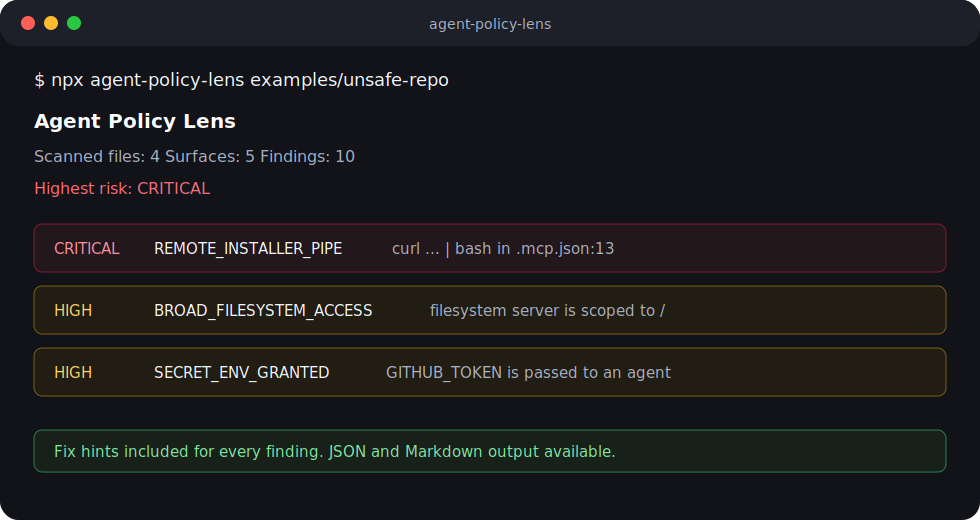

# Agent Policy Lens 🔍

<p align="center">
  
  
  
  
  
  =20">
</p>

<p align="center">
  <b>See what your AI agents can run, read, and leak.</b><br>
  <sub>A zero-dependency CLI that inventories AI agent and MCP permissions before they surprise you.</sub><br>
  <sub>零依赖 CLI 工具 — 在 AI Agent 和 MCP 权限变成安全隐患之前，先把它们列出来。</sub>
</p>

<p align="center">
  
</p>

---

```bash
npx agent-policy-lens .
```

---

## Why this exists · 为什么需要它

AI coding tools are becoming part of the development environment, but their permissions are scattered across multiple config formats — easy to miss in review:

- One MCP server can receive a repo path **and** an API token
- One package script can pipe a remote installer into a shell
- One agent instruction file can normalize auto-approval
- One `.env` file can accidentally turn a demo into a credential leak

AI 编程工具正在成为开发环境的一部分，但它们的权限分散在多种配置格式中，Code review 时很容易遗漏。

This tool gives teams a single, diffable "agent permission inventory" before those configs become invisible background noise.

---

## Demo · 演示

```bash
npx agent-policy-lens examples/unsafe-repo
```

```
Agent Policy Lens
Root: examples/unsafe-repo
Scanned files: 4
Surfaces: 5
Findings: 10 (critical=2, high=8)
Highest risk: CRITICAL

Findings
1. [CRITICAL] REMOTE_INSTALLER_PIPE .mcp.json:13
   Remote script is piped into a shell
   Fix: Pin and verify downloaded artifacts before execution.
2. [CRITICAL] REMOTE_INSTALLER_PIPE package.json:3
   Remote script is piped into a shell
3. [HIGH] PLAINTEXT_REMOTE_AGENT .cursor/mcp.json:4
   Agent endpoint uses plaintext HTTP
4. [HIGH] SECRET_ENV_GRANTED .cursor/mcp.json:6
   Secret-like environment variable is granted to an agent
5. [HIGH] UNPINNED_PACKAGE_RUNNER .mcp.json:5
   Agent uses an unpinned package runner
6. [HIGH] BROAD_FILESYSTEM_ACCESS .mcp.json:6
   Agent can read a broad filesystem path
7. [HIGH] SECRET_ENV_GRANTED .mcp.json:8
   Secret-like environment variable is granted to an agent
8. [HIGH] SHELL_COMMAND_AGENT .mcp.json:12
   Agent starts through an unrestricted shell
9. [HIGH] AUTO_APPROVE_ENABLED .mcp.json:14
   Agent approvals appear to be automatic
10. [HIGH] INSTRUCTION_AUTO_APPROVE CLAUDE.md:3
   Instruction asks for automatic approval
```

In one scan: remote scripts piped into shells, plaintext HTTP agent endpoints, secrets granted to agents, unpinned runners, broad filesystem access, and auto-approval — across MCP configs, instruction files, and package scripts.

一次扫描就能发现：远程脚本管道注入、明文 HTTP agent 端点、secret 泄露给 agent、未锁定包管理器、宽泛文件系统访问、自动审批。

---

## What it finds · 检测范围

| Category · 类别 | Files · 文件 |
|----------|-------|
| MCP configs | `.mcp.json`, `mcp.json`, `.cursor/mcp.json`, `.vscode/mcp.json`, `claude_desktop_config.json` |
| Agent instructions | `AGENTS.md`, `CLAUDE.md`, `GEMINI.md`, `.cursorrules`, `.windsurfrules` |
| Copilot instructions | `.github/copilot-instructions.md`, `.github/instructions/*.instructions.md` |
| Environment files | `.env*` |
| Package scripts | agent-related `package.json` scripts |

It flags patterns such as / 检测以下模式：

- 🚨 Remote scripts piped into a shell — `curl ... | bash`
- 📦 Unpinned runtime package runners — `npx`, `uvx`, `pipx` without version pins
- 📂 Broad filesystem access — `/`, `C:\`, `$HOME`, `%USERPROFILE%`
- 🔑 Secret-like environment variables granted to an agent
- 👁️ Possible live secrets in committed config (OpenAI, Anthropic, GitHub, AWS keys)
- 🌐 Plaintext remote agent endpoints — `http://` instead of `https://`
- ⚡ Auto-approval or safety-bypass instructions

---

## Install · 安装

```bash
npm install -g agent-policy-lens
```

Or run without installing:

```bash
npx agent-policy-lens .
```

**Zero dependencies.** Nothing to install beyond Node.js ≥ 20.

**零依赖。** 除了 Node.js ≥ 20 之外什么都不需要。

---

## Usage · 使用

```bash
agent-policy-lens [path] [options]
# Short alias:
aplens [path] [options]
```

### Options

| Option | Description |
|--------|-------------|
| `--format <table\|json\|markdown>` | Output format. Default: `table` |
| `--out <file>` | Write output to a file |
| `--fail-on <severity\|none>` | Exit code 2 when highest risk reaches this level |
| `--include-home` | Also inspect known global agent config paths |
| `--max-depth <number>` | Directory walk depth. Default: `6` |
| `-h, --help` | Show help |

### Common Commands · 常用命令

```bash
# Quick scan
agent-policy-lens .

# Markdown report for PRs
agent-policy-lens . --format markdown --out agent-policy-report.md

# Block CI if high+ findings
agent-policy-lens . --fail-on high

# Include global configs + JSON for bots
agent-policy-lens . --include-home --format json
```

---

## Output Formats · 输出格式

| Format | Best for · 最适合 |
|--------|----------|
| `table` (default) | Humans in the terminal · 终端人类阅读 |
| `markdown` | PR artifacts, GitHub comments · PR 产物 |
| `json` | Bots, CI pipelines · 自动化管道 |

```bash
agent-policy-lens . --format markdown --out agent-policy-report.md
```

---

## CI Integration · CI 集成

Add this workflow to scan every PR:

```yaml
name: Agent Policy Lens

on:
  pull_request:
  push:
    branches: [main]

jobs:
  scan-agent-policy:
    runs-on: ubuntu-latest
    steps:
      - uses: actions/checkout@v4
      - uses: actions/setup-node@v4
        with:
          node-version: 22
      - run: npx agent-policy-lens . --format markdown --out agent-policy-report.md --fail-on high
      - uses: actions/upload-artifact@v4
        if: always()
        with:
          name: agent-policy-report
          path: agent-policy-report.md
```

---

## Rule Philosophy · 规则理念

Agent Policy Lens is intentionally opinionated and explainable. It does **not** claim every finding is a vulnerability. It points at permission surfaces that deserve a human sentence in review:

- What does this agent receive?
- What can it execute?
- What paths can it read or write?
- What network endpoint sees context?
- Is this behavior pinned and reproducible?

See [docs/rules.md](docs/rules.md) for the full rule set.

---

## Why Zero Dependencies · 为什么零依赖

- **Auditable** — Every line of code is in this repo. No supply chain to trust.
- **Fast** — `npx agent-policy-lens .` completes in under a second.
- **CI-native** — No install step beyond Node.js. Works on every runner.
- **Secure** — A security tool shouldn't depend on 500 packages you haven't reviewed.

**可审计** — 所有代码都在这个仓库里，没有需要信任的供应链。
**快** — `npx agent-policy-lens .` 一秒内完成。
**CI 原生** — 不需要额外安装，所有 runner 都能跑。
**安全** — 安全工具本身不应该依赖 500 个你没审查过的包。

---

## Roadmap

- [ ] SARIF output for GitHub code scanning
- [ ] Repo baseline support (`.agent-policy-lens.json` for accepted risks)
- [ ] More global config formats (Codex, Claude, Cursor, Windsurf, VS Code)
- [ ] First-class MCP server allowlists
- [ ] PR comment mode (post findings directly to PR)
- [ ] Pre-commit hook

---

## Development · 开发

```bash
npm test
node src/cli.js examples/unsafe-repo
node src/cli.js examples/safe-repo
```

---

## Related · 相关资源

- [Model Context Protocol (MCP)](https://modelcontextprotocol.io/) — The protocol this tool helps secure
- [Hermes Agent Guide](https://github.com/yushizehuohuo-gif/hermes-agent-guide) — AGENTS.md best practices for Windows
- [OWASP Top 10 for LLM Applications](https://owasp.org/www-project-top-10-for-large-language-model-applications/) — Broader LLM security context

---

## License

MIT © [SHIZE YU (HuoHuoOvO)](https://github.com/yushizehuohuo-gif)

---

<p align="center">
  <sub>Found a bug? Missing a detection? <a href="https://github.com/yushizehuohuo-gif/agent-policy-lens/issues">Open an issue</a></sub>
</p>
